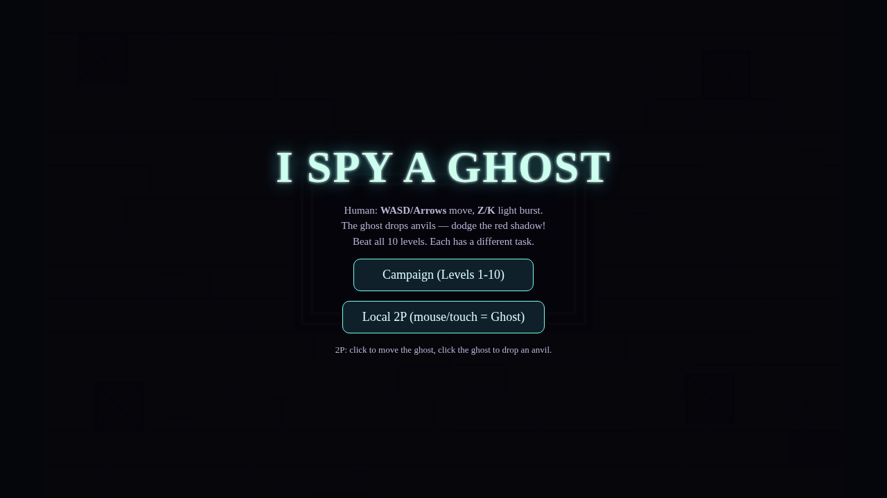

# I Spy a Ghost

> A spooky, fast-paced browser game where a human hunts a ghost with a flashlight—and the ghost fights back with falling anvils.

[](https://mahatirmahmud688601-wq.github.io/A-Spy-Ghost/)
[](https://developer.mozilla.org/en-US/docs/Web/API/Canvas_API)
[](#license)



## About the game

**I Spy a Ghost** is a lightweight, zero-install horror arcade game that runs directly in a modern web browser. Explore the haunted room, aim your flashlight, banish the ghost, and survive increasingly difficult challenges.

### Highlights

- **10-level campaign** with banish, survive, and collect objectives
- **Local 2-player mode**: one player controls the human, the other controls the ghost
- Atmospheric canvas graphics with darkness, flashlight cones, particles, ghost effects, and anvil impact feedback
- Responsive layout for desktop and mobile browsers
- No build tools, frameworks, or external assets required

## Play

**[Open the live game](https://mahatirmahmud688601-wq.github.io/A-Spy-Ghost/)**

The game loads instantly in the browser. No installation is needed.

## Controls

### Human

| Action | Keyboard |
|---|---|
| Move | `WASD` or Arrow keys |
| Light burst | `Z` or `K` |
| Goal | Shine the light on the ghost to banish it; dodge the red anvil shadows |

### Ghost — Local 2P mode

| Action | Mouse / touch |
|---|---|
| Move ghost | Click or tap a destination |
| Drop anvil | Click or tap directly on the ghost |
| Goal | Catch the human before the ghost is banished |

## Run locally

Because this is a static HTML5 game, you can run it with any local web server:

```bash
git clone https://github.com/mahatirmahmud688601-wq/A-Spy-Ghost.git
cd A-Spy-Ghost
python3 -m http.server 8080
```

Then open <http://localhost:8080>.

> Opening `index.html` directly also works in most modern browsers, but a local server is recommended for the best browser compatibility.

## Tech stack

- HTML5 Canvas
- Vanilla JavaScript
- CSS
- No dependencies

## Project structure

```text
.
├── index.html                   # Playable game entry point
├── I Spy A Ghost – Remake.html  # Original source filename
├── I Spy A Ghost –.md           # Original game notes
└── assets/
    └── spy-ghost-preview.png    # README preview image
```

## License

MIT License. See the repository history for the original project files.

---

Made for the web by [mahatirmahmud688601-wq](https://github.com/mahatirmahmud688601-wq).
